# Individual Report

LarAdmin - A laravel administrative interface that can help you build a CRUD backend with low/no-code. 

Laradmin can generate pages, forms and grid by json data, and can be easier to develop a custom CRUD backend pages using a json editor.

Inspired by [laravel-admin](https://laravel-admin.org/docs/en/).

GitHub committed Logs List:
https://github.com/jf-xia/laradmin/commits/main

## A Sample Usage Scenario

1. A user Jack registers a new account.
2. Jack logs in with his email and password.
3. administrator (Account: admin@admin.com; Password: 11111111) attach a admin role to the user Jack 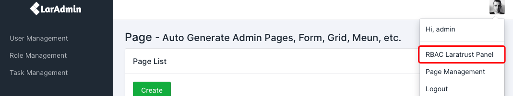
4. Jack is a administrator now, and he can access Page and Role Management after he got administrator role
5. Jack create a new table tasks by phpMyAdmin
   1. `id` int unsigned NOT NULL AUTO_INCREMENT,
   2. `title` varchar(255),
   3. `start_at` datetime,
   4. `created_at` timestamp,
   5. `updated_at` timestamp,
   6. `deleted_at` timestamp,
6. Jack Create a new Page "Task" by fill some fields, validation error will display if title and url are empty.
   1. Title: Task Management
   2. URL: page/tasks
   3. Model: App\Models\System\Model|tasks
   4. Template: {"form":{"title":"Create Task","action":"model/tasks","fields":[{"id":"title","name":"title","type":"text","class":"form-control","front":"input","label":"Title","placeholder":"Title"},{"id":"start_at","name":"start_at","type":"text","class":"form-control","front":"date","label":"Start At","placeholder":"Start At"}],"viewClass":{"field":"col","label":"form-label col-3 col-form-label","form-group":"form-group mb-3 row"},"subTemplate":"1"},"table":{"title":"Task List","delete":"model/tasks","columns":{"id":"ID","title":"Title","end_at":"End At","start_at":"Start At","created_at":"Create At","updated_at":"Updated At"},"searchField":"title"}}
7. Jack posted a task “I plan to visit Tokyo Disneyland with my family” with start date “2021-11-11”. 
8. Jack can edit the task table and page, for example, add a new map location field.
9.  Jack can find all the posted tasks on http(s)://domain/page/tasks
10. Jack can delete any tasks on http(s)://domain/page/tasks
11. Jack can search tasks by title on http(s)://domain/page/tasks
12. Jack can develop a new field widget.
    1.  create date.blade.php in view/tabler/widgets/form, include HTML, CSS, and JS
    2.  add a new date(...) function in app/Widgets/Form.php
13. Jack can develop a new page widget by create a new Class in app/Widgets, and JSON template in page view files(create and edit).

## A Sample CRM system Design Scenario

1. Run SQL script 'storage/app/mysql/laradmin2021_04_06_16_03_31.sql' in mysql database, some new table will be created: customers, leads, contracts, and those pages and its JSON are already set in.
2. A new user Joseph registers a new account.
3. Joseph logs in with his email and password.
4. Only administrator can see all menus, so in this scenario Joseph can only see Customer page.
5. Joseph can see all customers and create new customer, but he can only edit or delete his own customer. Otherwise, system will show an error: 401 Unauthorized.
6. Joseph can create a new customer "HKU".
7. Joseph can click edit "HKU" customer to the edit page.
8. Joseph can update customer name to "The University of Hong Kong" in the edit page.
9. Joseph can also create or delete tasks, leads and contracts related to "HKU" in the edit page.
10. By using Page Management and mysql to create pages and tables, administrator can add more Relational Entities to customer, such as: opportunity, contact, campaign, quote, product, competitor, invoice, receipt, etc...

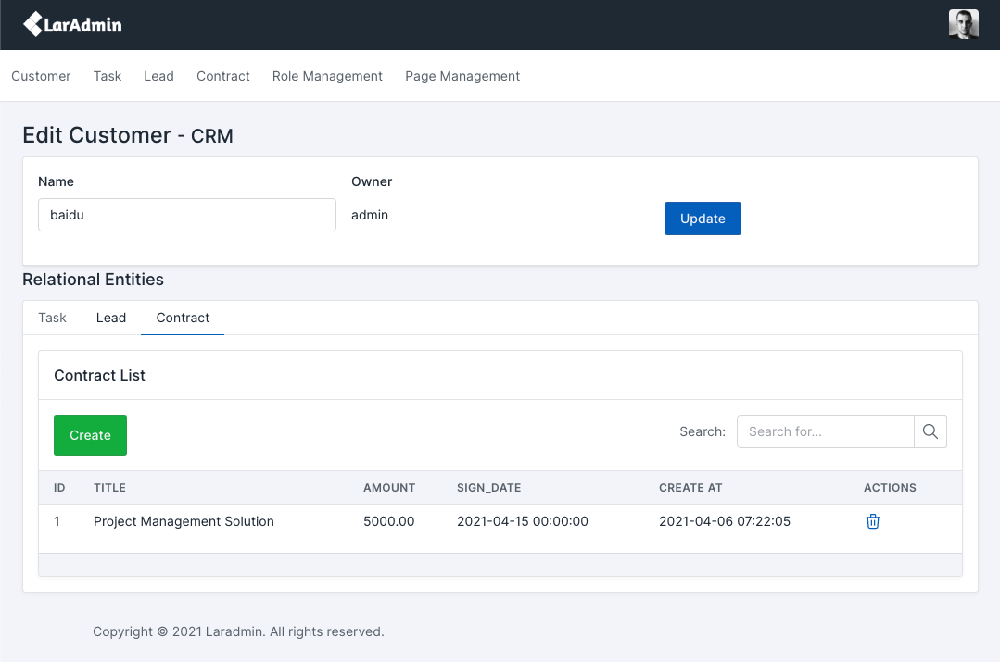
    
## Module 1: Login and Register by Tabler Template

1. Setup mysql database, and Run php artisan migrate and php artisan make:auth.
2. Add Auth::routes(); in routes/web.php.
3. Edit resources/views/layouts/app.blade.php and resources/views/auth/login.blade.php by Using [Tabler sign-in](https://preview.tabler.io/sign-in.html).
4. Edit resources/views/auth/register.blade.php with layouts/app.blade.php by Using [Tabler sign-up](https://preview.tabler.io/sign-up.html).
5. Do the same to verify.blade.php, confirm.blade.php, email.blade.php, reset.blade.php.

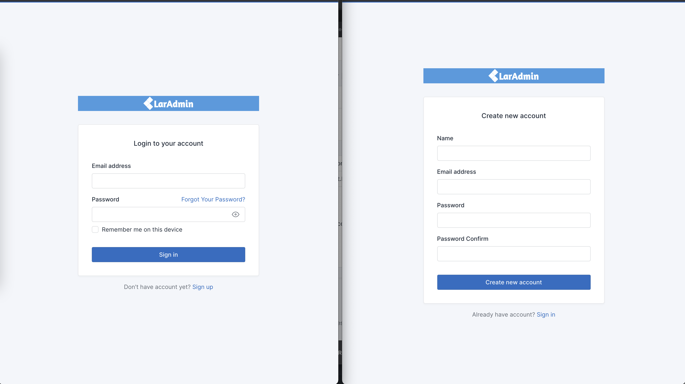

GitHub committed Log:
https://github.com/jf-xia/laradmin/commit/45f4a9c9768047660c3dad98a89d89bea3b49001

## Module 2: Backend System View

1. Defining a blade layout resources/views/tabler/layouts/container.blade.php using tabler's layout-combo styles and js libs.
2. Using a blade layout by @extends('tabler.layouts.container'), and content of the layout can be included in $page->html(), $page is a model object for pages. $page->html() function will load page title, description, json template and generate forms and grid.
3. Create form, table, input box widgets for PageController to combine the widgets by JSON template and render the page by the blade layout.
4. Create some partials for the blade layout, such as: 
   1. alerts.blade.php, to display form validation errors.
   2. sidebar.blade.php, menus are rendered by page model, and header bar with logout button.
   3. toastr.blade.php, use Session to show the Success or Error messages.
5. Design a logo for LarAdmin.

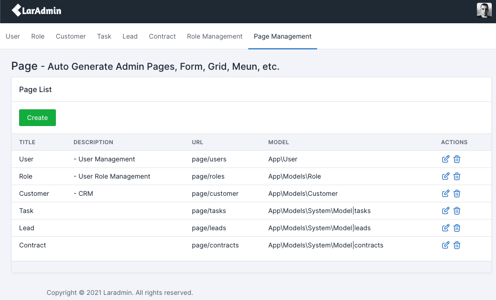

GitHub committed Log:
https://github.com/jf-xia/laradmin/commit/652f7d7ca0ef90e66b9dbdb7994b64449cdb4583

## Module 3: Page Management and Model CRUD

1. Create PageController and \App\Models\Page for create, update, delete, and list with paginate.
2. Create PageRequest for form validation.
3. Create pages/edit.blade.php with [jsoneditor](https://github.com/josdejong/jsoneditor).
4. Create a simple JSON template for form and tabe in JavaScript by jsoneditor.
5. Create ModelController (Custom Model CRUD Controller) for search, create, delete, and list with paginate.
6. Create Model to dynamic load table like: new \App\Models\Model($tableName).
7. Auto add routers by loop \App\Models\Page (cached).

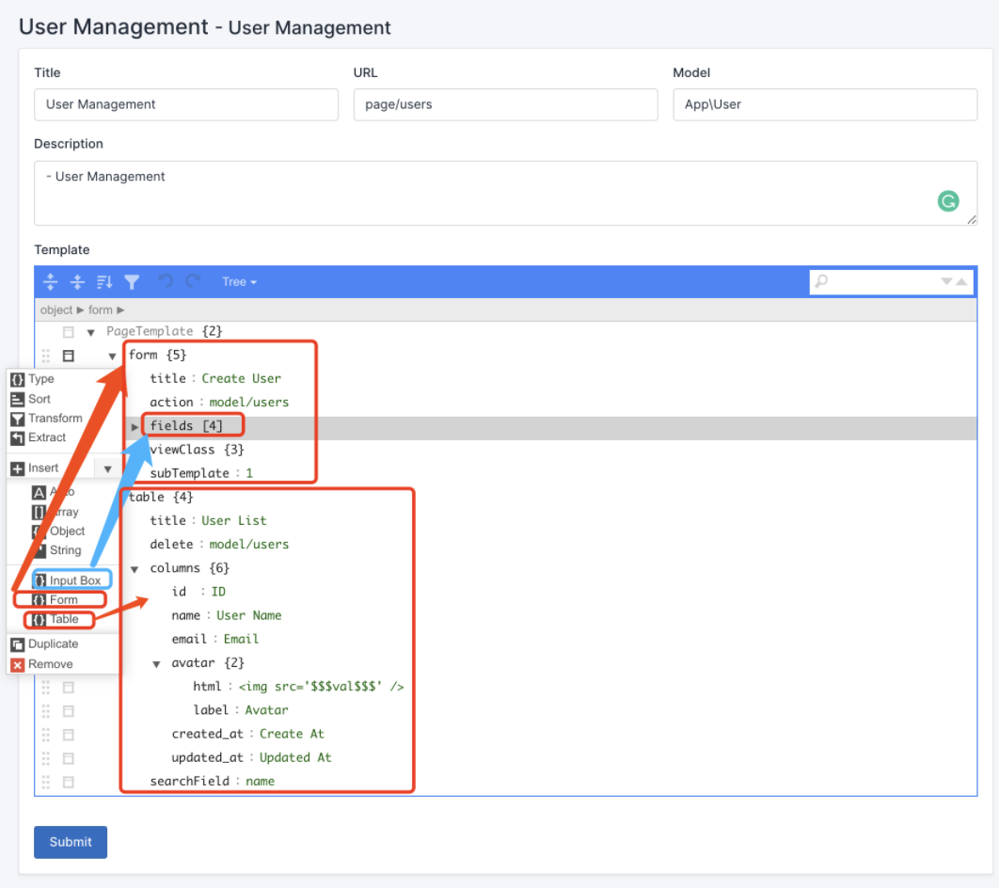
Page Management with JSON Editor

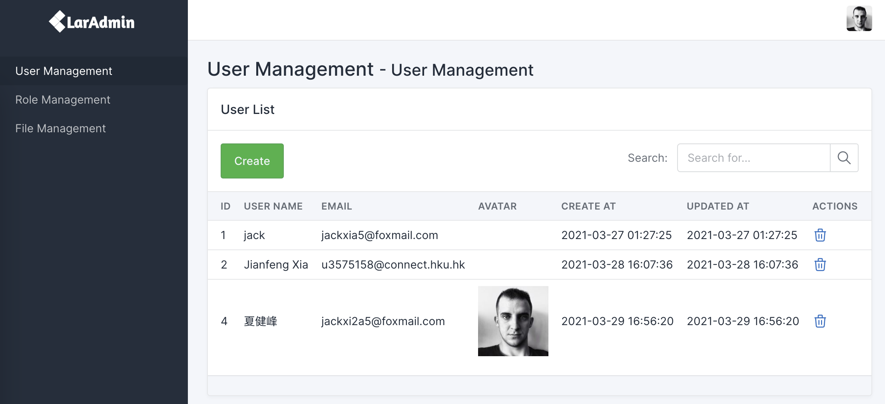
Auto-generate User List by Add JSON "table":{} in Page Management

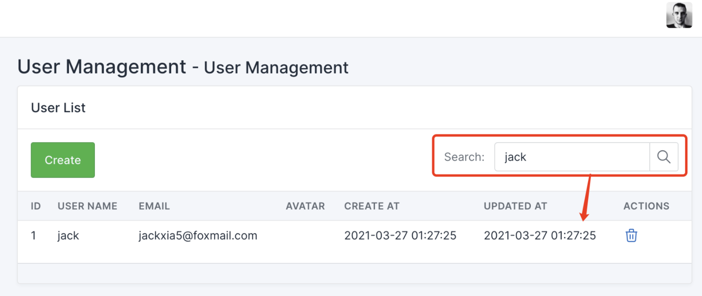
Auto-generate User Name Search by Add JSON "table":{"search":"name"} in Page Management

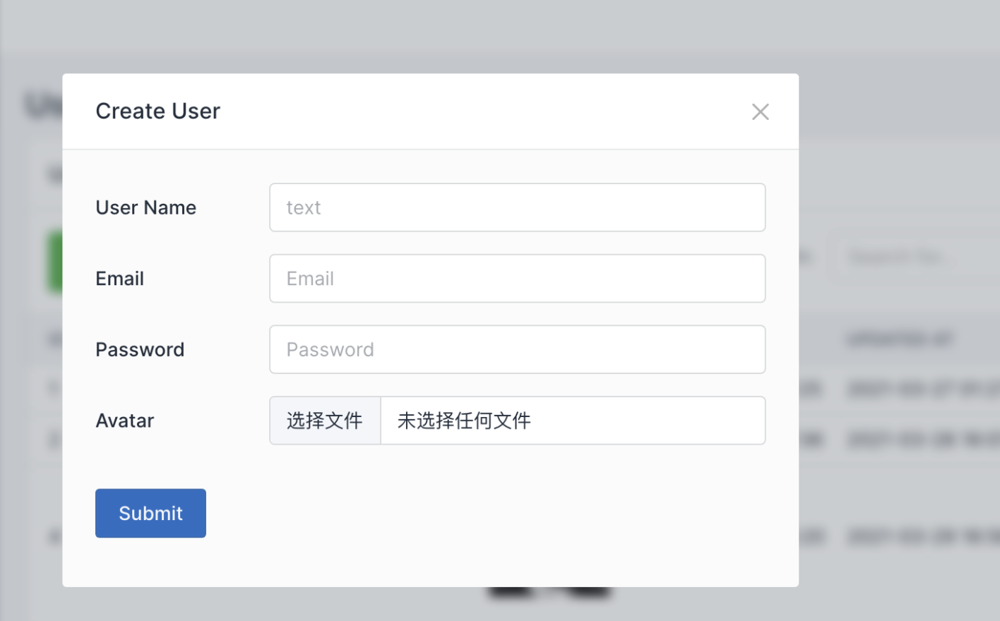
Auto-generate Create User Form by Add JSON "form":{} in Page Management

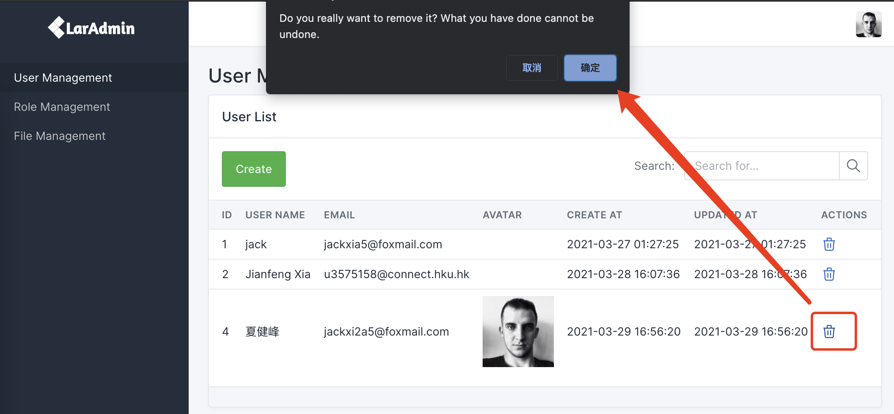
Auto-generate AJAX User Delete Action by Add JSON "table":{"delete":"model/users"} in Page Management

GitHub committed Log:
https://github.com/jf-xia/laradmin/commit/94d2e6e0f808a540500367ed47242f14a0a9c3ff

## Module 4: User Management with RBAC (Role-Based Access Control)

1. Install Laratrust: composer require santigarcor/laratrust.
2. Publish and Edit the configuration file: php artisan vendor:publish --tag="laratrust".
3. Run php artisan laratrust:setup and php artisan migrate.
4. Edit sidebar.blade.php, PageRequest and PageController, that only user who has admin role can see and edit pages.

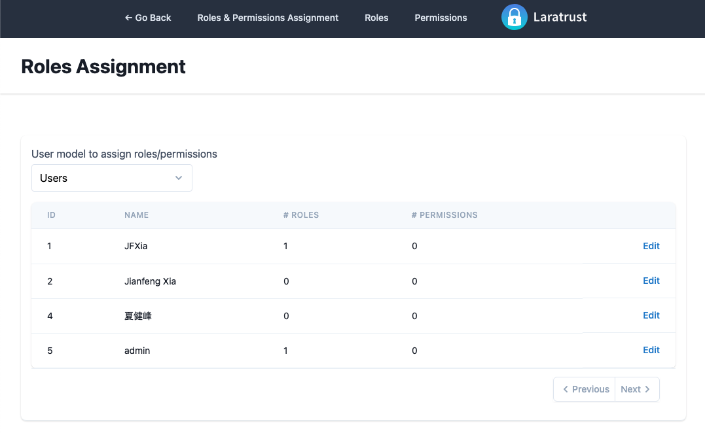

GitHub committed Log:
https://github.com/jf-xia/laradmin/commit/da52ec87e8d40fed39b7b64bc322795613118197

## Module 5: Tencent Cloud COS API for File Upload Field Widget

1. Install Tencent Cloud COS SDK: composer require qcloud/cos-sdk-v5.
2. Register Tencent Cloud account and apply the configuration in config/filesystems.php and .env (COS_BUCKET, COS_SECRET_ID, COS_SECRET_KEY, etc.).
3. Add uploadFile($file) function to upload file by request Tencent Cloud COS API to the COS and return the file location url.
4. Edit ModelController, check the POST Request, if Request parameters are instance of \Illuminate\Http\UploadedFile, then use uploadFile($file) function to upload file and save the file location url to database.
5. Edit table.blade.php and JSON "table":{} to show the file or image.
6. Edit User's JSON Template, Add a field {"name": "avatar", "type": "file", "front": "input", "label": "Avatar"} in "form":{"fields":[]} to show the file upload field.

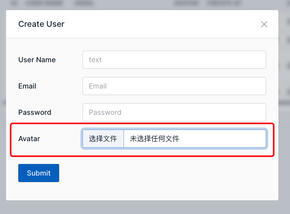

GitHub committed Log:
https://github.com/jf-xia/laradmin/commit/b1c8ee7540a96a0fba37cc2ddfee20a5cd8ee19d

## Module 6: Create Translate Field Widget: Tencent Cloud TextTranslate API

1. Install Tencent Cloud SDK: composer require tencentcloud/tencentcloud-sdk-php.
2. Register Tencent Cloud account and apply the configuration in .env (TTT_SECRET_ID, TTT_SECRET_KEY).
3. Add textTranslate() function to TencentController file and router to request Tencent Cloud TextTranslate API.
4. Create resources/views/tabler/widgets/form/translate.blade.php and edit app/Widgets/Form.php to build the translate field widget.
5. Edit Task's JSON Template, edit a field {"id": "title", "name": "title", "type": "text", "front": "translate", "label": "title"} in "form":{"fields":[]} to show the translate field.

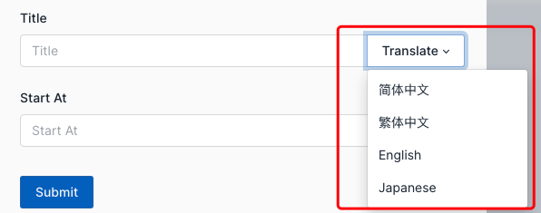

GitHub committed Log:
https://github.com/jf-xia/laradmin/commit/ee9e80b8b775e35e571f03c40efcb7d642a22b21
