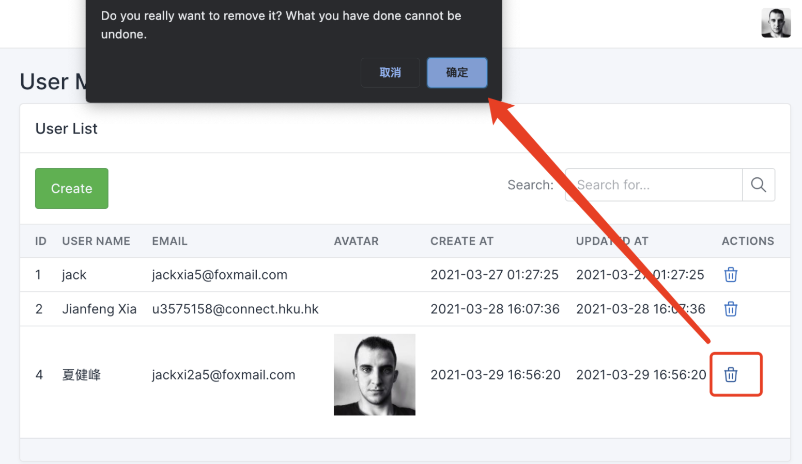

# Individual Report

LarAdmin - A laravel administrative interface that can help you build a CRUD backend with low/no-code. 

Inspired by [laravel-admin](https://laravel-admin.org/docs/en/), Laradmin can generate pages, forms and grid by json data, and can be easier to develop a custom CRUD backend pages using a json editor.

GitHub committed Logs List:
https://github.com/jf-xia/laradmin/commits/main

## Module 1: Login and Register by Tabler Template

1. Setup mysql database, and Run php artisan migrate and php artisan make:auth
2. Add Auth::routes(); in routes/web.php
3. Edit resources/views/layouts/app.blade.php and resources/views/auth/login.blade.php by Using [Tabler sign-in](https://preview.tabler.io/sign-in.html)
4. Edit resources/views/auth/register.blade.php with layouts/app.blade.php by Using [Tabler sign-up](https://preview.tabler.io/sign-up.html)
5. Do the same to verify.blade.php, confirm.blade.php, email.blade.php, reset.blade.php

GitHub committed Log:
https://github.com/jf-xia/laradmin/commit/45f4a9c9768047660c3dad98a89d89bea3b49001

## Module 2: Backend System View

1. Defining a blade layout resources/views/tabler/layouts/container.blade.php using tabler's layout-combo styles and js libs.
2. Using a blade layout by @extends('tabler.layouts.container'), and content of the layout can be included in $page->html(), $page is a model object for pages. $page->html() function will load page title, description, json template and generate forms and grid.
3. Create form, table, input box widgets for PageController to combine the widgets by JSON template and render the page by the blade layout.
4. Create some partials for the blade layout, such as: 
   1. alerts.blade.php, to display form validation errors 
   2. sidebar.blade.php, menus are rendered by page model, and header bar with logout button
   3. toastr.blade.php, use Session to show the Success or Error messages
5. Design a logo for LarAdmin

GitHub committed Log:
https://github.com/jf-xia/laradmin/commit/652f7d7ca0ef90e66b9dbdb7994b64449cdb4583

## Module 3: Page Management and Model CRUD

1. Create PageController and \App\Models\Page for create, update, delete, and list with paginate
2. Create PageRequest for form validation
3. Create pages/edit.blade.php with [jsoneditor](https://github.com/josdejong/jsoneditor)
4. Create a simple JSON template for form and tabe in JavaScript by jsoneditor
5. Create ModelController (Custom Model CRUD Controller) for search, create, delete, and list with paginate
6. Create Model to dynamic load table like: new \App\Models\Model($tableName)
7. Auto add routers by loop \App\Models\Page (cached)

GitHub committed Log:
https://github.com/jf-xia/laradmin/commit/94d2e6e0f808a540500367ed47242f14a0a9c3ff

## Module 4: User Management with RBAC (Role-Based Access Control)

1. Install Laratrust: composer require santigarcor/laratrust
2. Publish and Edit the configuration file: php artisan vendor:publish --tag="laratrust"
3. Run php artisan laratrust:setup and php artisan migrate
4. Edit sidebar.blade.php, only user who is admin role can see and edit pages

GitHub committed Log:
https://github.com/jf-xia/laradmin/commit/da52ec87e8d40fed39b7b64bc322795613118197

## Module 5: Tencent Cloud COS API for File Upload

GitHub committed Log:
https://github.com/jf-xia/laradmin/commit/b1c8ee7540a96a0fba37cc2ddfee20a5cd8ee19d
