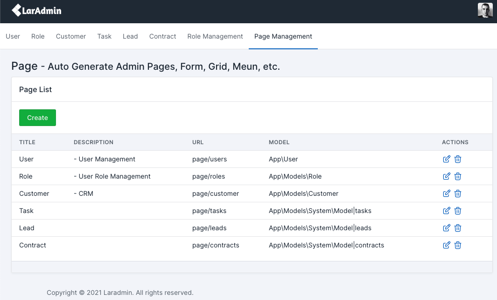
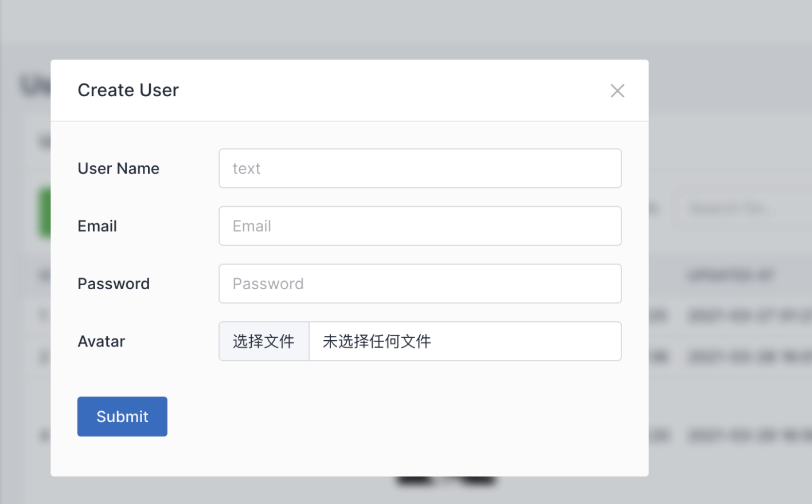
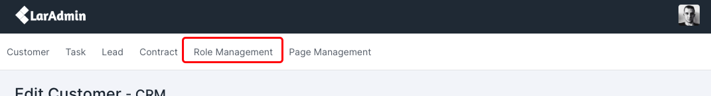
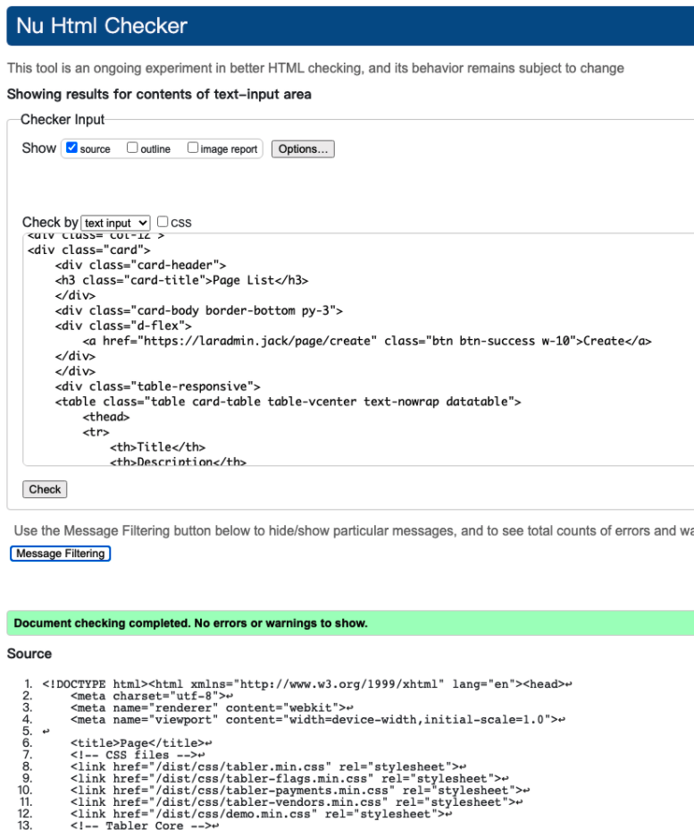

# Individual Report

## List of Work done

1. The View Layout by Tabler Template
2. User Login and Register
3. Page Management and CRUD Generator
4. Role-Based Access Control Management by Laratrust
5. File Upload Widget in Form by using Tencent Cloud COS API
6. Text Translate Input Widget by using Tencent Cloud TextTranslate API
7. Customer Relationship Management by using Module 1-6

GitHub committed Logs List:
https://github.com/jf-xia/laradmin/commits/main
    
## System design of Each Module Implemented

LarAdmin - A laravel administrative interface that can help you build a CRUD backend with low/no-code. 

Laradmin can generate pages, forms and grid by json data, and can be easier to develop a custom CRUD backend pages using a json editor.

Inspired by [laravel-admin](https://laravel-admin.org/docs/en/).

## Module 1: Login and Register by Tabler Template

1. Setup mysql database, and Run php artisan migrate and php artisan make:auth.
2. Add Auth::routes(); in routes/web.php.
3. Edit resources/views/layouts/app.blade.php and resources/views/auth/login.blade.php by Using [Tabler sign-in](https://preview.tabler.io/sign-in.html).
4. Edit resources/views/auth/register.blade.php with layouts/app.blade.php by Using [Tabler sign-up](https://preview.tabler.io/sign-up.html).
5. Do the same to verify.blade.php, confirm.blade.php, email.blade.php, reset.blade.php.

GitHub committed Log:
https://github.com/jf-xia/laradmin/commit/45f4a9c9768047660c3dad98a89d89bea3b49001

## Module 2: System View Layout Template

1. Defining a blade layout resources/views/tabler/layouts/container.blade.php using tabler's layout-combo styles and js libs.
2. Using a blade layout by @extends('tabler.layouts.container'), and content of the layout can be included in $page->html(), $page is a model object for pages. $page->html() function will load page title, description, json template and generate forms and grid.
3. Create form, table, input box widgets for PageController to combine the widgets by JSON template and render the page by the blade layout.
4. Create some partials for the blade layout, such as: 
   1. alerts.blade.php, to display form validation errors.
   2. sidebar.blade.php, menus are rendered by page model, and header bar with logout button.
   3. toastr.blade.php, use Session to show the Success or Error messages.
5. Design a logo for LarAdmin.

GitHub committed Log:
https://github.com/jf-xia/laradmin/commit/652f7d7ca0ef90e66b9dbdb7994b64449cdb4583

## Module 3: Page Management and CRUD Generator

1. Create PageController and \App\Models\Page for create, update, delete, and list with paginate.
2. Create PageRequest for form validation.
3. Create pages/edit.blade.php with [jsoneditor](https://github.com/josdejong/jsoneditor).
4. Create a simple JSON template for form and tabe in JavaScript by jsoneditor.
5. Create ModelController (Custom Model CRUD Controller) for search, create, delete, and list with paginate.
6. Create Model to dynamic load table like: new \App\Models\Model($tableName).
7. Auto add routers by loop \App\Models\Page (cached).

Page Management with JSON Editor

Auto-generate User List by Add JSON "table":{} in Page Management

Auto-generate User Name Search by Add JSON "table":{"search":"name"} in Page Management

Auto-generate Create User Form by Add JSON "form":{} in Page Management

Auto-generate AJAX User Delete Action by Add JSON "table":{"delete":"model/users"} in Page Management

GitHub committed Log:
https://github.com/jf-xia/laradmin/commit/94d2e6e0f808a540500367ed47242f14a0a9c3ff

## Module 4: Role-Based Access Control Management by Laratrust

1. Install Laratrust: composer require santigarcor/laratrust.
2. Publish and Edit the configuration file: php artisan vendor:publish --tag="laratrust".
3. Run php artisan laratrust:setup and php artisan migrate.
4. Edit sidebar.blade.php, PageRequest and PageController, that only user who has admin role can see and edit pages.

GitHub committed Log:
https://github.com/jf-xia/laradmin/commit/da52ec87e8d40fed39b7b64bc322795613118197

## Module 5: File Upload Widget in Form by using Tencent Cloud COS API

1. Install Tencent Cloud COS SDK: composer require qcloud/cos-sdk-v5.
2. Register Tencent Cloud account and apply the configuration in config/filesystems.php and .env (COS_BUCKET, COS_SECRET_ID, COS_SECRET_KEY, etc.).
3. Add uploadFile($file) function to upload file by request Tencent Cloud COS API to the COS and return the file location url.
4. Edit ModelController, check the POST Request, if Request parameters are instance of \Illuminate\Http\UploadedFile, then use uploadFile($file) function to upload file and save the file location url to database.
5. Edit table.blade.php and JSON "table":{} to show the file or image.
6. Edit User's JSON Template, Add a field {"name": "avatar", "type": "file", "front": "input", "label": "Avatar"} in "form":{"fields":[]} to show the file upload field.

GitHub committed Log:
https://github.com/jf-xia/laradmin/commit/b1c8ee7540a96a0fba37cc2ddfee20a5cd8ee19d

## Module 6: Text Translate Input Widget by using Tencent Cloud TextTranslate API

1. Install Tencent Cloud SDK: composer require tencentcloud/tencentcloud-sdk-php.
2. Register Tencent Cloud account and apply the configuration in .env (TTT_SECRET_ID, TTT_SECRET_KEY).
3. Add textTranslate() function to TencentController file and router to request Tencent Cloud TextTranslate API.
4. Create resources/views/tabler/widgets/form/translate.blade.php and edit app/Widgets/Form.php to build the translate field widget.
5. Edit Task's JSON Template, edit a field {"id": "title", "name": "title", "type": "text", "front": "translate", "label": "title"} in "form":{"fields":[]} to show the translate field.

GitHub committed Log:
https://github.com/jf-xia/laradmin/commit/ee9e80b8b775e35e571f03c40efcb7d642a22b21

## Module 7: Customer Relationship Management by using Module 1-6

1. Create Customer Model and add relation to User Model by user_id.
2. Add a relational ID customer_id to relate tables to the customer in Lead, Task, Contract. Then, customer edit page will only show the data list related to the customer. 
3. Create CustomerController and auto save user_id as current login user with other fields when update or create.
4. Validate data when Create or update in CustomerController. 
5. Create customer edit page, this page will show some customer information and customer's related tables such as: Lead, Task, Contract. You can add any other table by Low-code Page Builder Scenario and add the page Id in $relations = Page::query()->findMany([28,29,30]) in CustomerController edit function.
6. Create  A toastr Success/Error popup will show when create, update and delete are done.
7. Only Admin user can see sub menus for pages

GitHub committed Log:
https://github.com/jf-xia/laradmin/commit/d477dc99359bf21f480a6d8e508ddef33169956e

## A Sample Low-code Page Builder Scenario

1. A user Jack registers a new account.
2. Jack logs in with his email and password.
3. administrator (Account: admin@admin.com; Password: 11111111) attach an admin role to the user Jack 
4. Jack is an administrator now, and he can access Page and Role Management after he got administrator role
5. Jack create a new table "tasks" by phpMyAdmin
   1. `id` int unsigned NOT NULL AUTO_INCREMENT,
   2. `title` varchar(255),
   3. `start_at` datetime,
   4. `created_at` timestamp,
   5. `updated_at` timestamp,
   6. `deleted_at` timestamp,
6. Jack Create a new Page "Task" by filling some fields, validation error will display if title and URL are empty.
   1. Title: Task Management
   2. URL: page/tasks
   3. Model: App\Models\System\Model|tasks
   4. Template: {"form":{"title":"Create Task","action":"model/tasks","fields":[{"id":"title","name":"title","type":"text","class":"form-control","front":"input","label":"Title","placeholder":"Title"},{"id":"start_at","name":"start_at","type":"text","class":"form-control","front":"date","label":"Start At","placeholder":"Start At"}],"viewClass":{"field":"col","label":"form-label col-3 col-form-label","form-group":"form-group mb-3 row"},"subTemplate":"1"},"table":{"title":"Task List","delete":"model/tasks","columns":{"id":"ID","title":"Title","end_at":"End At","start_at":"Start At","created_at":"Create At","updated_at":"Updated At"},"searchField":"title"}}
7. Jack posted a task “I plan to visit Tokyo Disneyland with my family” with start date “2021-11-11”. 
8. Jack can edit the task table and page, for example, add a new map location field.
9.  Jack can find all the posted tasks on http(s)://domain/page/tasks
10. Jack can delete any tasks on http(s)://domain/page/tasks
11. Jack can search tasks by title on http(s)://domain/page/tasks
12. Jack can develop a new field widget.
    1.  create date.blade.php in view/tabler/widgets/form, include HTML, CSS, and JS
    2.  add a new date(...) function in app/Widgets/Form.php
13. Jack can develop a new page widget by creating a new Class in app/Widgets, and JSON template in page view files(create and edit).

## A Sample CRM system Design Scenario

1. Run SQL script 'storage/app/mysql/laradmin2021_04_14_16_59_32.sql' in mysql database, some new tables will be created, including customers, leads, contracts, and those pages and its JSON are already set in.
2. A new user Joseph registers a new account.
3. Joseph logs in with his email and password.
4. Only the administrator can see all menus, so in this scenario, Joseph can only see the customer page.
5. Joseph can see all customers and create new customer, but he can only edit or delete his own customer. Otherwise, the system will show an error: 401 Unauthorized.
6. Joseph can create a new customer "HKU".
7. Joseph can click edit "HKU" customer to the edit page.
8. Joseph can update the customer name to "The University of Hong Kong" in the edit page.
9. Joseph can also create or delete tasks, leads and contracts related to "HKU" on the edit page.
10. By using Page Management and mysql to create pages and tables, the administrator can add more Relational Entities to customer edit page, such as opportunity, contact, campaign, quote, product, competitor, invoice, receipt, etc...

## HTML Validation

## Program Files and Descriptions

|Program Files|Descriptions|
|:-|:-|
|	├── XIA_Jianfeng_Individual_Report.md	|	XIA Jianfeng Individual Report	|
|	├── LICENSE	|	Project License MIT	|
|	├── README.md	|	Project ReadMe	|
|	├── app	|		|
|	│   ├── Http	|		|
|	│   │   ├── Controllers	|		|
|	│   │   │   ├── Api	|		|
|	│   │   │   │   └── TencentController.php	|	Tencent textTranslate API	|
|	│   │   │   ├── Auth	|	From Laravel Auth Generator	|
|	│   │   │   ├── System	|		|
|	│   │   │   │   ├── ModelController.php	|	Get Current Model and search, create & upload file & delete to the Model	|
|	│   │   │   │   └── PageController.php	|	Page Create, Read/List, Update, Delete action	|
|	│   │   │   ├── CustomerController.php	|	Customer Create, Update, Delete action with Role based Access Control and Relation Entities	|
|	│   │   └── Requests	|		|
|	│   │       └── PageRequest.php	|	Page Request Data Validations	|
|	│   ├── Models	|		|
|	│   │   ├── System	|		|
|	│   │   │   ├── Model.php	|	Auto Set table name to model	|
|	│   │   │   └── Page.php	|	Page Model with Build page by template json and App\Widgets and cache	|
|	│   │   ├── Customer.php	|	Get Customer Owner by belongsTo and SoftDeletes	|
|	│   │   ├── Permission.php	|	SoftDeletes	|
|	│   │   ├── Role.php	|	SoftDeletes	|
|	│   ├── User.php	|	Add LaratrustUserTrait	|
|	│   └── Widgets	|		|
|	│       ├── Form.php	|	form with field generator: date, translate, input	|
|	│       ├── Table.php	|	table generator	|
|	│       └── Widget.php	|	render html and __toString	|
|	├── database	|		|
|	│   ├── migrations	|		|
|	│   │   ├── 2021_04_21_062436_create_contracts_table.php	|	contracts migrations file	|
|	│   │   ├── 2021_04_21_062436_create_customers_table.php	|	customers migrations file	|
|	│   │   ├── 2021_04_21_062436_create_leads_table.php	|	leads migrations file	|
|	│   │   ├── 2021_04_21_062436_create_pages_table.php	|	pages migrations file	|
|	│   │   └── 2021_04_21_062436_create_tasks_table.php	|	tasks migrations file	|
|	├── doc	|	doc images	|
|	├── public	|		|
|	│   ├── dist	|		|
|	│   │   ├── css	|		|
|	│   │   │   ├── tabler.*.css	|	From lib	|
|	│   │   ├── js	|		|
|	│   │   │   ├── jquery-3.5.1.min.js	|	From lib	|
|	│   │   │   └── tabler.min.js	|	From lib	|
|	│   ├── logo.png	|	logo design	|
|	│   ├── vendor	|		|
|	│   │   ├── jsoneditor	|	json editor for page management	|
|	│   │   └── toastr	|	Display Messages	|
|	├── resources	|		|
|	│   └── views	|		|
|	│       ├── auth	|		|
|	│       │   ├── login.blade.php	|	login page use tabler style	|
|	│       │   ├── passwords	|		|
|	│       │   │   ├── confirm.blade.php	|	passwords confirm page use tabler style	|
|	│       │   │   ├── email.blade.php	|	send email page use tabler style	|
|	│       │   │   └── reset.blade.php	|	forgot password page use tabler style	|
|	│       │   ├── register.blade.php	|	register page use tabler style	|
|	│       │   └── verify.blade.php	|	forgot password get verification link  use tabler style	|
|	│       ├── errors	|		|
|	│       │   ├── 401.blade.php	|	custom error pages	|
|	│       │   ├── 403.blade.php	|	custom error pages	|
|	│       │   ├── 404.blade.php	|	custom error pages	|
|	│       │   ├── 419.blade.php	|	custom error pages	|
|	│       │   ├── 429.blade.php	|	custom error pages	|
|	│       │   ├── 500.blade.php	|	custom error pages	|
|	│       │   ├── 503.blade.php	|	custom error pages	|
|	│       │   └── minimal.blade.php	|	custom error template pages	|
|	│       ├── layouts	|		|
|	│       │   └── app.blade.php	|	Auth login and register page template use tabler style	|
|	│       └── tabler	|		|
|	│           ├── customers	|		|
|	│           │   └── edit.blade.php	|	custom edit page	|
|	│           ├── layouts	|		|
|	│           │   ├── container.blade.php	|	backend template	|
|	│           │   └── page.blade.php	|	page template	|
|	│           ├── pages	|		|
|	│           │   ├── create.blade.php	|	create pages for page management, with json editor: js Validate, JSON templates	|
|	│           │   ├── edit.blade.php	|	edit pages for page management, with json editor: js Validate, JSON templates	|
|	│           │   └── index.blade.php	|	list pages for page management, and ajax delete action	|
|	│           ├── partials	|		|
|	│           │   ├── alerts.blade.php	|	show alerts or errors for Data validations	|
|	│           │   ├── header.blade.php	|	show header and top menu	|
|	│           │   ├── sidebar.blade.php	|	pages menu for admin only	|
|	│           │   └── toastr.blade.php	|	popup messages for success or fail	|
|	│           └── widgets	|		|
|	│               ├── card.blade.php	|	card widget view	|
|	│               ├── form	|		|
|	│               │   ├── date.blade.php	|	form field date widget view	|
|	│               │   ├── input.blade.php	|	form field input widget view	|
|	│               │   └── translate.blade.php	|	form field translate widget view	|
|	│               ├── form.blade.php	|	form widget view	|
|	│               └── table.blade.php	|	table widget view	|
|	├── routes	|		|
|	│   └── web.php	|	some routes	|
|	├── storage	|		|
|	│   ├── app	|		|
|	│   │   ├── mysql	|		|
|	│   │   │   └── laradmin2021_04_14_16_59_32.sql	|	sql script	|